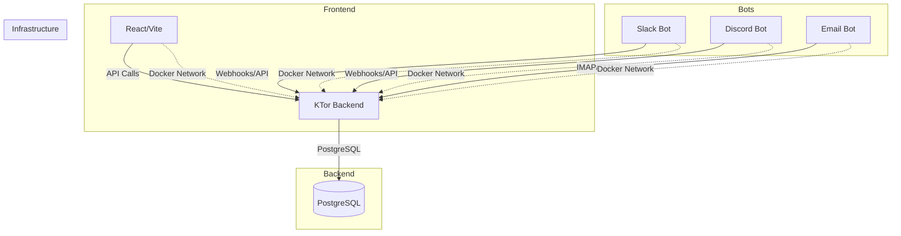

# CRM/Support System - Starter Monorepo

A self-hosted CRM/support system with a modern full-stack architecture. Every component runs in Docker containers.

## Architecture



## Tech Stack

| Component | Technology |
|-----------|------------|
| Backend | KTor 3.5.1, Kotlin 2.4.10, Exposed ORM, PostgreSQL |
| Frontend | React 18+, TypeScript, Vite |
| Bots | Node.js 24+, TypeScript |
| Containerization | Docker + Docker Compose |

## Quickstart

```bash
# Clone and start the entire stack
docker-compose up --build
```

This will:
1. Start PostgreSQL on port 5432
2. Start the KTor backend on port 8080
3. Start the React frontend on port 3000
4. Start all bot services (Slack, Discord, Email)

## Services

| Service | Port | Description | Container |
|---------|------|-------------|-----------|
| postgres | 5432 | PostgreSQL database | crm-postgres |
| backend | 8080 | KTor REST API | crm-backend |
| frontend | 3000 | React web application | crm-frontend |
| slack-bot | - | Slack integration bot | crm-slack-bot |
| discord-bot | - | Discord integration bot | crm-discord-bot |
| email-bot | - | Email processing bot | crm-email-bot |

## API Endpoints

| Method | Endpoint | Description | Response |
|--------|----------|-------------|----------|
| GET | `/api/health` | Health check with database connectivity | `{"status": "ok", "database": "connected"}` |

## Development

### Backend (KTor + Exposed ORM)
- **Location**: `apps/backend/`
- **Language**: Kotlin 2.4.10
- **Framework**: KTor 3.5.1
- **ORM**: Exposed 1.3.1
- **Database**: PostgreSQL 15
- **Build**: `docker-compose build backend`
- **Run**: `docker-compose up backend`
- **Local Maven Build**: `mvn clean package -DskipTests` (requires JDK 25)

### Frontend (React + Vite)
- **Location**: `apps/frontend/`
- **Framework**: React 18+, TypeScript
- **Bundler**: Vite 5.x
- **Build**: `docker-compose build frontend`
- **Run**: `docker-compose up frontend`
- **Dev Mode**: `pnpm dev` (inside container)

### Bots (Node.js + TypeScript)
Each bot is a separate Node.js service with Docker support:
- **Slack Bot**: `apps/bots/slack/` - Slack integration bot
- **Discord Bot**: `apps/bots/discord/` - Discord integration bot
- **Email Bot**: `apps/bots/email/` - Email processing bot

Each bot includes:
- TypeScript source in `src/index.ts`
- `package.json` with type: module
- Dockerfile for containerization

## Docker Compose Commands

```bash
# Start all services
docker-compose up --build

# Start specific service
docker-compose up backend
docker-compose up frontend
docker-compose up slack-bot
docker-compose up discord-bot
docker-compose up email-bot

# View logs
docker-compose logs -f
docker-compose logs backend
docker-compose logs frontend

# Stop all services
docker-compose down

# Stop and remove volumes (including database data)
docker-compose down -v

# View running containers
docker ps

# View container logs
docker logs crm-backend

# Build specific service
docker-compose build backend
docker-compose build frontend

# Pull latest images (if not using build)
docker-compose pull
```

## Environment Variables

### Backend
- `DB_URL`: PostgreSQL connection URL (default: `jdbc:postgresql://postgres:5432/crm`)
- `DB_USER`: Database username (default: `crm`)
- `DB_PASSWORD`: Database password (default: `crm`)

### Frontend
- Proxies `/api` requests to backend via Vite config and nginx

## Project Structure

```
crm-support/
├── apps/
│   ├── backend/
│   │   ├── src/
│   │   │   └── Application.kt      # KTor server with Exposed ORM
│   │   ├── pom.xml                # Maven dependencies
│   │   └── Dockerfile              # Multi-stage: JDK build, JRE runtime
│   │
│   ├── frontend/
│   │   ├── src/
│   │   │   ├── main.tsx           # React app entry
│   │   │   └── index.html         # HTML template
│   │   ├── vite.config.ts          # Vite proxy config
│   │   ├── package.json
│   │   ├── tsconfig.json
│   │   ├── tsconfig.node.json
│   │   └── Dockerfile              # Node build, nginx serve
│   │
│   └── bots/
│       ├── slack/
│       │   ├── src/
│       │   │   └── index.ts       # Slack bot stub
│       │   ├── package.json
│       │   ├── tsconfig.json
│       │   └── Dockerfile
│       ├── discord/
│       │   ├── src/
│       │   │   └── index.ts       # Discord bot stub
│       │   ├── package.json
│       │   ├── tsconfig.json
│       │   └── Dockerfile
│       └── email/
│           ├── src/
│           │   └── index.ts       # Email bot stub
│           ├── package.json
│           ├── tsconfig.json
│           └── Dockerfile
├── docker-compose.yml              # Orchestrates all services
├── pnpm-workspace.yaml             # pnpm workspace config
├── .gitignore
└── README.md
```

## Health Checks

| Service | Health Check | Endpoint |
|---------|--------------|----------|
| PostgreSQL | `pg_isready -U crm -d crm` | N/A |
| Backend | `curl -f http://localhost:8080/api/health` | `/api/health` |

## Database

- **Engine**: PostgreSQL 15 (Alpine)
- **Database**: `crm`
- **User**: `crm`
- **Password**: `crm`
- **Port**: 5432
- **Volume**: `crm-postgres-data` (persistent storage)
- **Network**: `crm-network` (custom Docker network)

## Agent Configuration

For AI agent assistance with this project, see [AGENTS.md](./AGENTS.md) for instructions and constraints.

## Troubleshooting

### Common Issues

**Docker Build Fails**:
- Ensure Docker is running: `docker --version`
- Check disk space: `docker system df`
- Clean build cache: `docker-compose build --no-cache`

**Backend Won't Start**:
- Check PostgreSQL is healthy: `docker-compose logs postgres`
- Verify database connection: `docker-compose logs backend`
- Test manually: `curl http://localhost:8080/api/health`

**Frontend Shows Errors**:
- Ensure backend is running: `docker ps`
- Check API proxy: Frontend calls `/api` which proxies to backend
- Verify backend logs: `docker-compose logs backend`

**Port Already in Use**:
- List processes: `lsof -i :3000` or `lsof -i :8080`
- Kill conflicting process or change ports in docker-compose.yml

## Contributing

1. Fork the repository
2. Create a feature branch (`git checkout -b feature/your-feature`)
3. Make your changes
4. Test with `docker-compose up --build`
5. Commit your changes (`git commit -m 'Add some feature'`)
6. Push to the branch (`git push origin feature/your-feature`)
7. Open a Pull Request

## License

MIT License - Feel free to use this starter template for your own projects.

