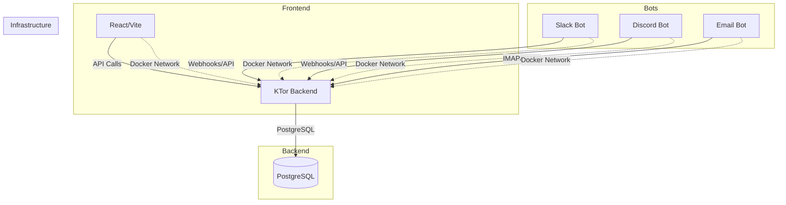

# CRM/Support System Monorepo

[](https://github.com/LD-C-Software/crm-support/actions/workflows/ci.yml)

A self-hosted CRM/support system with a modern full-stack architecture. Every component runs in Docker containers.

## Architecture



## Tech Stack

| Component | Technology |
|-----------|------------|
| Backend | KTor 3.5.1, Kotlin 2.4.0, Exposed ORM 1.3.1, PostgreSQL 18 |
| Frontend | React 19, TypeScript 7, Vite 8 |
| Bots | Node.js 24+, TypeScript 7 |
| Containerization | Docker + Docker Compose |

## Prerequisites

To run the whole stack, you only need:

- **Docker** and **Docker Compose v2** (`docker compose version` or `docker-compose version`)

To develop a service outside its container (faster feedback loop than rebuilding an image on every change), you'll also need, depending on what you're touching:

| Working on | Install |
|------------|---------|
| Frontend (`apps/frontend`) or bots (`apps/bots/*`) | Node.js 24.x and pnpm — `corepack enable` picks up the version pinned in [package.json](package.json)'s `packageManager` field automatically; otherwise `npm install -g pnpm@11.13.1` |
| Backend (`apps/backend`) | JDK 25 and Maven |

## Running the App

```bash
# Clone the repo, then from its root:
docker-compose up --build
```

This will:
1. Start PostgreSQL on port 5432
2. Start the KTor backend on port 8080
3. Start the React frontend on port 3000
4. Start all bot services (Slack, Discord, Email)

Once it's up:
- Frontend: [http://localhost:3000](http://localhost:3000)
- Backend health check: [http://localhost:8080/api/health](http://localhost:8080/api/health)

Run it in the background with `docker-compose up --build -d`, watch logs with `docker-compose logs -f`, and stop everything with `docker-compose down` (see [Docker Compose Commands](#docker-compose-commands) for more).

## Services

| Service | Port | Description | Container |
|---------|------|-------------|-----------|
| postgres | 5432 | PostgreSQL database | crm-postgres |
| backend | 8080 | KTor REST API | crm-backend |
| frontend | 3000 | React web application | crm-frontend |
| slack-bot | - | Slack integration bot | crm-slack-bot |
| discord-bot | - | Discord integration bot | crm-discord-bot |
| email-bot | - | Email processing bot | crm-email-bot |

## API Endpoints

| Method | Endpoint | Description | Response |
|--------|----------|-------------|----------|
| GET | `/api/health` | Health check with database connectivity | `{"status": "ok", "database": "connected"}` |

## Development

Running everything through `docker-compose up --build` works, but rebuilding an image for every code change is slow. For active development, run Postgres (and whichever services you're *not* editing) in Docker, and run the service you're actually working on directly on your machine.

Install JS/TS dependencies once from the repo root — this covers the frontend, all three bots, and the shared `packages/config`. This also sets up the git hooks described in [CI, Git Hooks & Deployment](#ci-git-hooks--deployment):

```bash
pnpm install
```

Root-level aggregate scripts run the same check across every JS/TS package at once — useful before pushing, and exactly what CI runs:

```bash
pnpm run lint          # eslint across frontend + all 3 bots
pnpm run typecheck     # tsc --noEmit across frontend + all 3 bots
pnpm run test          # vitest across frontend + all 3 bots
pnpm run format:check  # prettier, repo-wide (pnpm run format to auto-fix)
```

### Backend (KTor + Exposed ORM)
- **Location**: `apps/backend/`
- **Language**: Kotlin 2.4.0
- **Framework**: KTor 3.5.1
- **ORM**: Exposed 1.3.1 (imports live under `org.jetbrains.exposed.v1.*` since the 1.0 rewrite)
- **Database**: PostgreSQL 18
- **Run via Docker**: `docker-compose up --build backend` (needs `postgres` running too; `docker-compose up --build postgres backend` starts both)
- **Run locally**:
  ```bash
  # Start just the database in Docker, publishing 5432 to the host
  docker-compose up -d postgres

  cd apps/backend
  mvn clean package -DskipTests    # requires JDK 25
  DB_URL=jdbc:postgresql://localhost:5432/crm java -jar target/backend.jar
  ```
- **Test**: `curl http://localhost:8080/api/health`

### Frontend (React + Vite)
- **Location**: `apps/frontend/`
- **Framework**: React 19, TypeScript 7
- **Bundler**: Vite 8.x
- **Run via Docker**: `docker-compose up --build frontend` (production build, served by nginx)
- **Run locally** (hot-reloading dev server): with a backend reachable at `http://localhost:8080` (either `docker-compose up -d postgres backend` or running it locally per above), run:
  ```bash
  cd apps/frontend
  pnpm dev
  ```
  This serves the app at [http://localhost:3000](http://localhost:3000) and proxies `/api` requests to `http://localhost:8080`.
- **Lint**: `pnpm --filter crm-frontend run lint` (or `cd apps/frontend && pnpm run lint`)
- **Typecheck**: `pnpm --filter crm-frontend run typecheck`
- **Test**: `pnpm --filter crm-frontend run test` (Vitest; currently just a placeholder smoke test — see [Limitations](#limitations))

### Bots (Node.js + TypeScript)
Each bot is a separate Node.js service with Docker support:
- **Slack Bot**: `apps/bots/slack/` - Slack integration bot
- **Discord Bot**: `apps/bots/discord/` - Discord integration bot
- **Email Bot**: `apps/bots/email/` - Email processing bot

Each bot includes:
- TypeScript source in `src/index.ts`
- `package.json` with type: module
- Dockerfile for containerization

- **Run via Docker**: `docker-compose up --build slack-bot` (or `discord-bot` / `email-bot`)
- **Run locally**: `cd apps/bots/<slack|discord|email> && pnpm run build && pnpm run start`
- **Lint**: `pnpm --filter crm-<name>-bot run lint`
- **Test**: `pnpm --filter crm-<name>-bot run test` (Vitest; currently just a placeholder smoke test — see [Limitations](#limitations))

## Dependency Management

### Pinning

Every dependency in this repo is pinned to an exact version — no `^`/`~` ranges in `package.json`, no version ranges or `LATEST`/`RELEASE` in `pom.xml`. Upgrades are explicit, reviewed edits, not something that happens silently on a fresh `install`.

### Sharing versions across packages (pnpm catalog)

The workspace (`apps/frontend` + the three bots + `packages/config`) uses a [pnpm catalog](https://pnpm.io/catalogs) for dependencies used by more than one package — `typescript`, `eslint`, and the ESLint/Prettier plugins they're built on, all defined once in `pnpm-workspace.yaml`:

```yaml
catalog:
  typescript: 7.0.2
  eslint: 10.7.0
  typescript-eslint: 8.63.0
  '@eslint/js': 10.0.1
  globals: 17.7.0
  eslint-config-prettier: 10.1.8
  eslint-plugin-react-hooks: 7.1.1
  eslint-plugin-react-refresh: 0.5.3
  prettier: 3.9.5
  vite: 8.1.4
  vitest: 4.1.10
```

Each `package.json` references an entry as `"typescript": "catalog:"` instead of repeating the version. To bump one everywhere, edit the single line in `pnpm-workspace.yaml` and run `pnpm install`. The backend is a single Maven module, so there's no equivalent "share across modules" story on that side — its versions already live in one place, `apps/backend/pom.xml`.

### Sharing tool configs (TypeScript, ESLint, Prettier, Vite)

`packages/config` (published internally as `@crm/config`, never to a real registry) is the single source of truth for how those four tools are configured, so no two packages have to hand-maintain the same rules:

| Tool | Shared file(s) | Consumed as |
|------|-----------------|-------------|
| TypeScript | `typescript/base.json`, `typescript/react-app.json`, `typescript/node.json` | `"extends": "@crm/config/typescript/react-app.json"` (or `node.json`) in each app's `tsconfig.json` |
| ESLint | `eslint/base.mjs`, `eslint/react.mjs`, `eslint/node.mjs` | `import reactConfig from '@crm/config/eslint/react.mjs'` in each app's `eslint.config.mjs` |
| Prettier | `prettier/index.ts` | One repo-root `prettier.config.ts` re-exports it — Prettier is a single, repo-wide formatter, not a per-package one |
| Vite | `vite/base.ts` | `mergeConfig(base, { ...appSpecificConfig })` in `apps/frontend/vite.config.ts` |

Only `apps/frontend` uses Vite today, but the base still lives in `@crm/config` so any future Vite-based service starts from the same defaults instead of copy-pasting `apps/frontend/vite.config.ts`.

**Most of these config files are TypeScript, but the ESLint ones deliberately aren't.** Node runs `.ts` files natively (no build step, no `ts-node`), and Prettier does the same when loading `prettier.config.ts` — both worked as soon as we tried them. ESLint's flat config *can* load a `.ts` file too, but only via an extra `jiti` dependency, and pulling that thread surfaced a real, currently-unresolved problem: `typescript-eslint` (any 8.x version) crashes immediately on import against TypeScript 7 — its parser still expects an enum (`ts.Extension`) that TypeScript 7's Go-rewritten package no longer exports the same way, and this repo is pinned to TypeScript 7 for everything else. So `eslint/*.mjs` and every `eslint.config.mjs` stay plain JS (with JSDoc types) rather than `.ts`, and there's no `jiti` dependency in the repo. See the [Version Constraints](AGENTS.md#version-constraints) note in AGENTS.md for the workaround this required (`packages/config` pins its own older `typescript` just for `typescript-eslint`'s sake, separate from the TypeScript 7 the rest of the repo uses).

Each app still declares its own `eslint`/`typescript` as a direct devDependency (pnpm's strict `node_modules` means a package only gets binaries for what it directly depends on — depending on `@crm/config` alone wouldn't put `eslint`/`tsc` on that package's `PATH`), plus `"@crm/config": "workspace:*"` for the actual config content.

**Docker builds see the shared config too.** `tsc`/`vite build` run *inside* the image for `apps/frontend` and the three bots, so for `extends`/`import` to resolve, `packages/config` has to be part of the build. Their four Dockerfiles therefore build from the **repo root** as context (`context: .` in `docker-compose.yml`, not `context: ./apps/frontend`), copying `pnpm-workspace.yaml`, the root `package.json`/lockfile, `packages/config`, `apps/frontend`, and `apps/bots` before running `pnpm install --frozen-lockfile`. `apps/backend`'s Dockerfile is unaffected (Maven/Kotlin doesn't participate in any of this) and still builds from `./apps/backend`.

### Guardrail: no package younger than 7 days

Newly-published versions are a common supply-chain attack vector (a maintainer's account gets compromised, a malicious version goes out, and it's often caught and pulled within days). This repo blocks installing anything published in the last week:

- **Frontend + bots (pnpm)**: `pnpm-workspace.yaml` sets `minimumReleaseAge: 10080` (7 days, in minutes) with `minimumReleaseAgeStrict: true`. This is enforced natively by pnpm on every `pnpm install`/`pnpm add` — for direct **and** transitive dependencies — and it re-verifies the committed `pnpm-lock.yaml` on every install, not just when adding something new. A too-new resolution makes the install fail outright rather than silently substituting an older version.
- **Backend (Maven)**: Maven has no built-in equivalent, so `scripts/check-dependency-age.ts` audits `apps/backend/pom.xml` (and, as a second line of defense, the npm side too) against each artifact's actual publish date on Maven Central / the npm registry. Run it with:

  ```bash
  node scripts/check-dependency-age.ts
  # or
  pnpm run check:dep-age
  ```

  This is a verification gate you run before merging a dependency bump (or wire into CI) — unlike the pnpm guardrail, it can't stop a `mvn install` from happening automatically, since Maven doesn't expose a hook for that.

## CI, Git Hooks & Deployment

### Git hooks (Husky)

`pnpm install` automatically wires up two hooks via the root `prepare` script:

| Hook | What it does |
|------|--------------|
| `pre-commit` | Runs `pnpm run lint` and `pnpm run format:check`. Check-only — it blocks the commit on a violation rather than auto-fixing; run `pnpm run format` (or fix the lint error) and commit again. |
| `pre-push` | Blocks `git push` straight to `main` from any machine with these hooks installed, forcing changes through a branch + PR instead. |

**The `pre-push` guard is a local stand-in for real GitHub branch protection, not a replacement for it.** This repo is private on a GitHub plan that doesn't support branch protection or repository rulesets (confirmed via the API — it returns "Upgrade to GitHub Pro or make this repository public"). The hook only affects pushes made from a machine that ran `pnpm install`; it's bypassable with `git push --no-verify` or from any clone without the hooks set up, and it has no effect on merging a PR via the GitHub UI/`gh pr merge`. See [Limitations](#limitations).

### CI (`.github/workflows/ci.yml`)

Runs on every pull request targeting `main` and every push to `main`:

| Job | What it runs |
|-----|--------------|
| `backend` | `mvn test` against `apps/backend` |
| `frontend-bots` | `pnpm run lint`, `pnpm run format:check`, `pnpm run typecheck` (+ the frontend's extra `tsconfig.node.json` check), `pnpm run test`, `pnpm -r run build` |
| `guardrails` | `node scripts/check-dependency-age.ts` |

The badge at the top of this README reflects the latest run against `main`. All third-party GitHub Actions are pinned to a commit SHA rather than a floating version tag.

### Deploy (`.github/workflows/deploy.yml`)

A placeholder, currently **manual-trigger only** (`workflow_dispatch` — run it from the Actions tab or `gh workflow run deploy.yml`). It builds nothing real yet; its steps are TODO stubs for pushing images to a registry and deploying to a real target. It will not run automatically until someone fills those in and changes its trigger to `push: branches: [main]`.

## Docker Compose Commands

```bash
# Start all services
docker-compose up --build

# Start specific service
docker-compose up backend
docker-compose up frontend
docker-compose up slack-bot
docker-compose up discord-bot
docker-compose up email-bot

# View logs
docker-compose logs -f
docker-compose logs backend
docker-compose logs frontend

# Stop all services
docker-compose down

# Stop and remove volumes (including database data)
docker-compose down -v

# View running containers
docker ps

# View container logs
docker logs crm-backend

# Build specific service
docker-compose build backend
docker-compose build frontend

# Pull latest images (if not using build)
docker-compose pull

# Run with production values instead of the local .env / built-in defaults
docker-compose --env-file .env.production up -d --build
```

## Environment Variables

### Docker Compose (`.env`, `.env.production`)

`docker-compose.yml` reads its configurable values (database credentials, host ports) from environment variables, each with a default baked in — so `docker-compose up --build` works with zero setup, with or without a `.env` file present:

| Variable | Default | Used by |
|----------|---------|---------|
| `POSTGRES_DB` | `crm` | `postgres`, and `backend`'s `DB_URL` |
| `POSTGRES_USER` | `crm` | `postgres`, and `backend`'s `DB_USER` |
| `POSTGRES_PASSWORD` | `crm` | `postgres`, and `backend`'s `DB_PASSWORD` |
| `POSTGRES_PORT` | `5432` | Host port `postgres` publishes to |
| `BACKEND_PORT` | `8080` | Host port `backend` publishes to |
| `FRONTEND_PORT` | `3000` | Host port `frontend` publishes to |

- **Local development**: copy [`.env.example`](.env.example) to `.env` (`cp .env.example .env`) and edit it — docker-compose loads `.env` from the project root automatically. This step is optional; the defaults above already match `.env.example`.
- **Production-like run**: copy [`.env.production.example`](.env.production.example) to `.env.production`, fill in a real `POSTGRES_PASSWORD` (the placeholder isn't usable as-is), and pass it explicitly — docker-compose only auto-loads a file literally named `.env`, so this one is opt-in on purpose:
  ```bash
  docker-compose --env-file .env.production up -d --build
  ```
- Both `.env` and `.env.production` are gitignored (only the `.example` templates are tracked) — never commit real credentials.

### Backend (running locally, outside Docker)
- `DB_URL`: PostgreSQL connection URL (default: `jdbc:postgresql://postgres:5432/crm`, which only resolves inside the Docker network — see [Development](#development) for the `localhost` equivalent)
- `DB_USER`: Database username (default: `crm`)
- `DB_PASSWORD`: Database password (default: `crm`)

### Frontend
- Proxies `/api` requests to the backend — via `vite.config.ts` (`http://localhost:8080`) in the local dev server, via `nginx.conf` (`http://backend:8080`) in the production container

## Project Structure

```
crm-support/
├── .github/
│   ├── workflows/
│   │   ├── ci.yml                  # backend/frontend-bots/guardrails, on PR + push to main
│   │   └── deploy.yml              # Manual-trigger-only placeholder, see Limitations
│   ├── ISSUE_TEMPLATE/
│   └── pull_request_template.md
│
├── .husky/
│   ├── pre-commit                  # lint + format:check, check-only
│   └── pre-push                    # Blocks direct push to main — local stand-in, see Limitations
│
├── apps/
│   ├── backend/
│   │   ├── src/
│   │   │   └── Application.kt      # KTor server with Exposed ORM
│   │   ├── pom.xml                # Maven dependencies
│   │   ├── Dockerfile              # Multi-stage: JDK build, JRE runtime; builds from ./apps/backend, unaffected by the below
│   │   └── .dockerignore
│   │
│   ├── frontend/
│   │   ├── src/
│   │   │   ├── main.tsx           # React app entry
│   │   │   ├── index.html         # HTML template (Vite root)
│   │   │   └── placeholder.test.ts # Vitest smoke test — see Limitations
│   │   ├── vite.config.ts          # Merges @crm/config/vite/base.ts
│   │   ├── eslint.config.mjs       # Re-exports @crm/config/eslint/react.mjs — plain JS, see note below
│   │   ├── package.json
│   │   ├── tsconfig.json           # Extends @crm/config/typescript/react-app.json
│   │   ├── tsconfig.node.json      # Extends @crm/config/typescript/base.json
│   │   └── Dockerfile              # Node build, nginx serve; builds from repo root context
│   │
│   └── bots/
│       ├── slack/
│       │   ├── src/
│       │   │   ├── index.ts       # Slack bot stub
│       │   │   └── placeholder.test.ts # Vitest smoke test — excluded from the tsc build output
│       │   ├── package.json
│       │   ├── tsconfig.json       # Extends @crm/config/typescript/node.json; excludes *.test.ts from build
│       │   ├── eslint.config.mjs   # Re-exports @crm/config/eslint/node.mjs
│       │   └── Dockerfile          # Builds from repo root context
│       ├── discord/                # Same layout as slack/
│       └── email/                  # Same layout as slack/
│
├── packages/
│   └── config/                     # @crm/config — shared tool configs, workspace:* only
│       ├── typescript/
│       │   ├── base.json           # Strictness options common to every package
│       │   ├── react-app.json      # + browser/bundler/jsx settings (extends base)
│       │   └── node.json           # + nodenext module settings (extends base)
│       ├── eslint/                 # Plain JS (.mjs), not .ts — see the note below
│       │   ├── base.mjs            # @eslint/js + typescript-eslint recommended
│       │   ├── react.mjs           # base + react-hooks/react-refresh + prettier compat
│       │   └── node.mjs            # base + node globals + prettier compat
│       ├── prettier/
│       │   └── index.ts            # The one Prettier config for the whole repo
│       ├── vite/
│       │   └── base.ts             # Shared Vite defaults, merged via mergeConfig()
│       └── package.json            # Pins its own `typescript@5.9.3` — see note below
│
├── scripts/
│   └── check-dependency-age.ts    # Maven + npm supply-chain age guardrail
├── docker-compose.yml              # frontend/bots build with context: . (repo root); backend keeps context: ./apps/backend
├── package.json                    # Root scripts (lint/typecheck/test/format/prepare), pinned packageManager, husky + prettier devDependencies
├── prettier.config.ts              # Re-exports @crm/config/prettier/index.ts
├── .prettierignore
├── .dockerignore                   # Used by the four root-context builds
├── .env.example                    # Copy to `.env` for local overrides (optional — see Environment Variables)
├── .env.production.example         # Copy to `.env.production`, fill in real secrets, use with --env-file
├── pnpm-workspace.yaml             # pnpm workspace config, catalog, age policy
├── pnpm-lock.yaml                  # Locked versions for the whole JS workspace
├── .gitignore
└── README.md
```

## Health Checks

| Service | Health Check | Endpoint |
|---------|--------------|----------|
| PostgreSQL | `pg_isready -U $POSTGRES_USER -d $POSTGRES_DB` | N/A |
| Backend | `curl -f http://localhost:8080/api/health` | `/api/health` |

## Database

- **Engine**: PostgreSQL 18 (Alpine)
- **Database / User / Password / Port**: `crm` / `crm` / `crm` / `5432` by default — override via `POSTGRES_DB`/`POSTGRES_USER`/`POSTGRES_PASSWORD`/`POSTGRES_PORT` in `.env` (see [Environment Variables](#environment-variables))
- **Volume**: `crm-postgres-data`, mounted at `/var/lib/postgresql` (PostgreSQL 18+ images lay out data in a version-specific subdirectory there, not at `/var/lib/postgresql/data` as in older images)
- **Network**: `crm-network` (custom Docker network)

## Limitations

Things that look done but have known gaps worth knowing about before relying on them:

- **No real branch protection.** GitHub branch protection / rulesets aren't available on this repo (private, on a plan that gates the feature — see [CI, Git Hooks & Deployment](#ci-git-hooks--deployment)). The `pre-push` git hook is a local-only workaround: it stops an accidental direct push from a machine that has the hooks installed, but it's not enforced by GitHub itself. Anyone can still push to `main` directly via `--no-verify`, an unhooked clone, or the GitHub web UI/API. Set up real branch protection (requiring the `backend`, `frontend-bots`, and `guardrails` checks) once the repo is public or the org is on a plan that supports it, and remove `.husky/pre-push` at that point.
- **Test coverage is a placeholder, not real coverage.** The backend has zero tests (`mvn test` currently passes only because there's nothing to run). The frontend and each bot have exactly one placeholder Vitest smoke test each, added to give CI something meaningful to run — none of them test actual behavior yet. A green CI run currently means "compiles, lints, and formats correctly," not "is correct."
- **Deploy is not wired up.** `.github/workflows/deploy.yml` is a manual-trigger-only stub with TODO steps — merging to `main` does not deploy anything anywhere yet.

## Agent Configuration

For AI agent assistance with this project, see [AGENTS.md](./AGENTS.md) for instructions and constraints.

## Troubleshooting

### Common Issues

**Docker Build Fails**:
- Ensure Docker is running: `docker --version`
- Check disk space: `docker system df`
- Clean build cache: `docker-compose build --no-cache`

**Backend Won't Start**:
- Check PostgreSQL is healthy: `docker-compose logs postgres`
- Verify database connection: `docker-compose logs backend`
- Test manually: `curl http://localhost:8080/api/health`

**Frontend Shows Errors**:
- Ensure backend is running: `docker ps`
- Check API proxy: Frontend calls `/api` which proxies to backend
- Verify backend logs: `docker-compose logs backend`

**Port Already in Use**:
- List processes: `lsof -i :3000` or `lsof -i :8080`
- Kill the conflicting process, or set `FRONTEND_PORT`/`BACKEND_PORT`/`POSTGRES_PORT` in `.env` (see [Environment Variables](#environment-variables)) instead of editing docker-compose.yml

## Contributing

1. Create a feature branch (`git checkout -b feature/your-feature`)
2. Make your changes
3. Test with `docker-compose up --build` (and/or the per-service `lint`/`typecheck`/`test` commands above)
4. Commit your changes (`git commit -m 'Add some feature'`) — the pre-commit hook runs lint + format:check automatically
5. Push the branch (`git push origin feature/your-feature`) — pushing to `main` directly is blocked locally, see [CI, Git Hooks & Deployment](#ci-git-hooks--deployment)
6. Open a Pull Request — CI runs automatically and reports status on the PR (not yet a hard merge gate, see [Limitations](#limitations))

## License

MIT License

