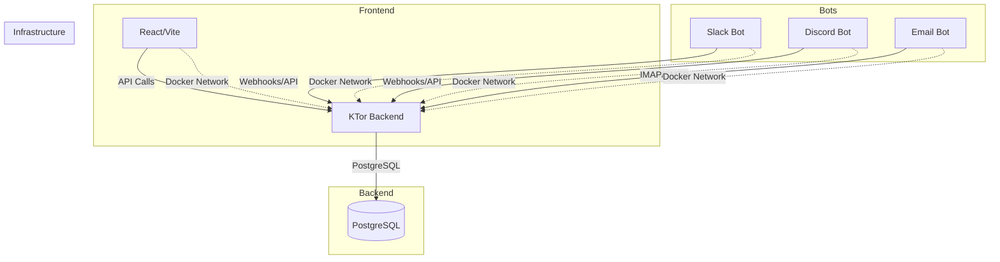

# CRM/Support System - Starter Monorepo

A self-hosted CRM/support system with a modern full-stack architecture. Every component runs in Docker containers.

## Architecture



## Tech Stack

| Component | Technology |
|-----------|------------|
| Backend | KTor 3.5.1, Kotlin 2.4.0, Exposed ORM 1.3.1, PostgreSQL 18 |
| Frontend | React 19, TypeScript 7, Vite 8 |
| Bots | Node.js 24+, TypeScript 7 |
| Containerization | Docker + Docker Compose |

## Quickstart

```bash
# Clone and start the entire stack
docker-compose up --build
```

This will:
1. Start PostgreSQL on port 5432
2. Start the KTor backend on port 8080
3. Start the React frontend on port 3000
4. Start all bot services (Slack, Discord, Email)

## Services

| Service | Port | Description | Container |
|---------|------|-------------|-----------|
| postgres | 5432 | PostgreSQL database | crm-postgres |
| backend | 8080 | KTor REST API | crm-backend |
| frontend | 3000 | React web application | crm-frontend |
| slack-bot | - | Slack integration bot | crm-slack-bot |
| discord-bot | - | Discord integration bot | crm-discord-bot |
| email-bot | - | Email processing bot | crm-email-bot |

## API Endpoints

| Method | Endpoint | Description | Response |
|--------|----------|-------------|----------|
| GET | `/api/health` | Health check with database connectivity | `{"status": "ok", "database": "connected"}` |

## Development

### Backend (KTor + Exposed ORM)
- **Location**: `apps/backend/`
- **Language**: Kotlin 2.4.0
- **Framework**: KTor 3.5.1
- **ORM**: Exposed 1.3.1 (imports live under `org.jetbrains.exposed.v1.*` since the 1.0 rewrite)
- **Database**: PostgreSQL 18
- **Build**: `docker-compose build backend`
- **Run**: `docker-compose up backend`
- **Local Maven Build**: `mvn clean package -DskipTests` (requires JDK 25)

### Frontend (React + Vite)
- **Location**: `apps/frontend/`
- **Framework**: React 19, TypeScript 7
- **Bundler**: Vite 8.x
- **Build**: `docker-compose build frontend`
- **Run**: `docker-compose up frontend`
- **Dev Mode**: `pnpm dev` (inside container)
- **Lint**: `pnpm --filter crm-frontend run lint` (or `cd apps/frontend && pnpm run lint`)
- **Typecheck**: `pnpm --filter crm-frontend run typecheck`

### Bots (Node.js + TypeScript)
Each bot is a separate Node.js service with Docker support:
- **Slack Bot**: `apps/bots/slack/` - Slack integration bot
- **Discord Bot**: `apps/bots/discord/` - Discord integration bot
- **Email Bot**: `apps/bots/email/` - Email processing bot

Each bot includes:
- TypeScript source in `src/index.ts`
- `package.json` with type: module
- Dockerfile for containerization
- **Lint**: `pnpm --filter crm-<name>-bot run lint`

## Dependency Management

### Pinning

Every dependency in this repo is pinned to an exact version — no `^`/`~` ranges in `package.json`, no version ranges or `LATEST`/`RELEASE` in `pom.xml`. Upgrades are explicit, reviewed edits, not something that happens silently on a fresh `install`.

### Sharing versions across packages (pnpm catalog)

The workspace (`apps/frontend` + the three bots + `packages/config`) uses a [pnpm catalog](https://pnpm.io/catalogs) for dependencies used by more than one package — `typescript`, `eslint`, and the ESLint/Prettier plugins they're built on, all defined once in `pnpm-workspace.yaml`:

```yaml
catalog:
  typescript: 7.0.2
  eslint: 10.7.0
  typescript-eslint: 8.63.0
  '@eslint/js': 10.0.1
  globals: 17.7.0
  eslint-config-prettier: 10.1.8
  eslint-plugin-react-hooks: 7.1.1
  eslint-plugin-react-refresh: 0.5.3
  prettier: 3.9.5
```

Each `package.json` references an entry as `"typescript": "catalog:"` instead of repeating the version. To bump one everywhere, edit the single line in `pnpm-workspace.yaml` and run `pnpm install`. The backend is a single Maven module, so there's no equivalent "share across modules" story on that side — its versions already live in one place, `apps/backend/pom.xml`.

### Sharing tool configs (TypeScript, ESLint, Prettier, Vite)

`packages/config` (published internally as `@crm/config`, never to a real registry) is the single source of truth for how those four tools are configured, so no two packages have to hand-maintain the same rules:

| Tool | Shared file(s) | Consumed as |
|------|-----------------|-------------|
| TypeScript | `typescript/base.json`, `typescript/react-app.json`, `typescript/node.json` | `"extends": "@crm/config/typescript/react-app.json"` (or `node.json`) in each app's `tsconfig.json` |
| ESLint | `eslint/base.mjs`, `eslint/react.mjs`, `eslint/node.mjs` | `import reactConfig from '@crm/config/eslint/react.mjs'` in each app's `eslint.config.mjs` |
| Prettier | `prettier/index.mjs` | One repo-root `prettier.config.mjs` re-exports it — Prettier is a single, repo-wide formatter, not a per-package one |
| Vite | `vite/base.mjs` | `mergeConfig(base, { ...appSpecificConfig })` in `apps/frontend/vite.config.ts` |

Only `apps/frontend` uses Vite today, but the base still lives in `@crm/config` so any future Vite-based service starts from the same defaults instead of copy-pasting `apps/frontend/vite.config.ts`.

Each app still declares its own `eslint`/`typescript` as a direct devDependency (pnpm's strict `node_modules` means a package only gets binaries for what it directly depends on — depending on `@crm/config` alone wouldn't put `eslint`/`tsc` on that package's `PATH`), plus `"@crm/config": "workspace:*"` for the actual config content.

**Docker builds see the shared config too.** `tsc`/`vite build` run *inside* the image for `apps/frontend` and the three bots, so for `extends`/`import` to resolve, `packages/config` has to be part of the build. Their four Dockerfiles therefore build from the **repo root** as context (`context: .` in `docker-compose.yml`, not `context: ./apps/frontend`), copying `pnpm-workspace.yaml`, the root `package.json`/lockfile, `packages/config`, `apps/frontend`, and `apps/bots` before running `pnpm install --frozen-lockfile`. `apps/backend`'s Dockerfile is unaffected (Maven/Kotlin doesn't participate in any of this) and still builds from `./apps/backend`.

### Guardrail: no package younger than 7 days

Newly-published versions are a common supply-chain attack vector (a maintainer's account gets compromised, a malicious version goes out, and it's often caught and pulled within days). This repo blocks installing anything published in the last week:

- **Frontend + bots (pnpm)**: `pnpm-workspace.yaml` sets `minimumReleaseAge: 10080` (7 days, in minutes) with `minimumReleaseAgeStrict: true`. This is enforced natively by pnpm on every `pnpm install`/`pnpm add` — for direct **and** transitive dependencies — and it re-verifies the committed `pnpm-lock.yaml` on every install, not just when adding something new. A too-new resolution makes the install fail outright rather than silently substituting an older version.
- **Backend (Maven)**: Maven has no built-in equivalent, so `scripts/check-dependency-age.mjs` audits `apps/backend/pom.xml` (and, as a second line of defense, the npm side too) against each artifact's actual publish date on Maven Central / the npm registry. Run it with:

  ```bash
  node scripts/check-dependency-age.mjs
  # or
  pnpm run check:dep-age
  ```

  This is a verification gate you run before merging a dependency bump (or wire into CI) — unlike the pnpm guardrail, it can't stop a `mvn install` from happening automatically, since Maven doesn't expose a hook for that.

## Docker Compose Commands

```bash
# Start all services
docker-compose up --build

# Start specific service
docker-compose up backend
docker-compose up frontend
docker-compose up slack-bot
docker-compose up discord-bot
docker-compose up email-bot

# View logs
docker-compose logs -f
docker-compose logs backend
docker-compose logs frontend

# Stop all services
docker-compose down

# Stop and remove volumes (including database data)
docker-compose down -v

# View running containers
docker ps

# View container logs
docker logs crm-backend

# Build specific service
docker-compose build backend
docker-compose build frontend

# Pull latest images (if not using build)
docker-compose pull
```

## Environment Variables

### Backend
- `DB_URL`: PostgreSQL connection URL (default: `jdbc:postgresql://postgres:5432/crm`)
- `DB_USER`: Database username (default: `crm`)
- `DB_PASSWORD`: Database password (default: `crm`)

### Frontend
- Proxies `/api` requests to backend via Vite config and nginx

## Project Structure

```
crm-support/
├── apps/
│   ├── backend/
│   │   ├── src/
│   │   │   └── Application.kt      # KTor server with Exposed ORM
│   │   ├── pom.xml                # Maven dependencies
│   │   ├── Dockerfile              # Multi-stage: JDK build, JRE runtime; builds from ./apps/backend, unaffected by the below
│   │   └── .dockerignore
│   │
│   ├── frontend/
│   │   ├── src/
│   │   │   ├── main.tsx           # React app entry
│   │   │   └── index.html         # HTML template (Vite root)
│   │   ├── vite.config.ts          # Merges @crm/config/vite/base.mjs
│   │   ├── eslint.config.mjs       # Re-exports @crm/config/eslint/react.mjs
│   │   ├── package.json
│   │   ├── tsconfig.json           # Extends @crm/config/typescript/react-app.json
│   │   ├── tsconfig.node.json      # Extends @crm/config/typescript/base.json
│   │   └── Dockerfile              # Node build, nginx serve; builds from repo root context
│   │
│   └── bots/
│       ├── slack/
│       │   ├── src/
│       │   │   └── index.ts       # Slack bot stub
│       │   ├── package.json
│       │   ├── tsconfig.json       # Extends @crm/config/typescript/node.json
│       │   ├── eslint.config.mjs   # Re-exports @crm/config/eslint/node.mjs
│       │   └── Dockerfile          # Builds from repo root context
│       ├── discord/                # Same layout as slack/
│       └── email/                  # Same layout as slack/
│
├── packages/
│   └── config/                     # @crm/config — shared tool configs, workspace:* only
│       ├── typescript/
│       │   ├── base.json           # Strictness options common to every package
│       │   ├── react-app.json      # + browser/bundler/jsx settings (extends base)
│       │   └── node.json           # + nodenext module settings (extends base)
│       ├── eslint/
│       │   ├── base.mjs            # @eslint/js + typescript-eslint recommended
│       │   ├── react.mjs           # base + react-hooks/react-refresh + prettier compat
│       │   └── node.mjs            # base + node globals + prettier compat
│       ├── prettier/
│       │   └── index.mjs           # The one Prettier config for the whole repo
│       ├── vite/
│       │   └── base.mjs            # Shared Vite defaults, merged via mergeConfig()
│       └── package.json
│
├── scripts/
│   └── check-dependency-age.mjs    # Maven + npm supply-chain age guardrail
├── docker-compose.yml              # frontend/bots build with context: . (repo root); backend keeps context: ./apps/backend
├── package.json                    # Root scripts, pinned packageManager, prettier devDependency
├── prettier.config.mjs             # Re-exports @crm/config/prettier/index.mjs
├── .prettierignore
├── .dockerignore                   # Used by the four root-context builds
├── pnpm-workspace.yaml             # pnpm workspace config, catalog, age policy
├── pnpm-lock.yaml                  # Locked versions for the whole JS workspace
├── .gitignore
└── README.md
```

## Health Checks

| Service | Health Check | Endpoint |
|---------|--------------|----------|
| PostgreSQL | `pg_isready -U crm -d crm` | N/A |
| Backend | `curl -f http://localhost:8080/api/health` | `/api/health` |

## Database

- **Engine**: PostgreSQL 18 (Alpine)
- **Database**: `crm`
- **User**: `crm`
- **Password**: `crm`
- **Port**: 5432
- **Volume**: `crm-postgres-data`, mounted at `/var/lib/postgresql` (PostgreSQL 18+ images lay out data in a version-specific subdirectory there, not at `/var/lib/postgresql/data` as in older images)
- **Network**: `crm-network` (custom Docker network)

## Agent Configuration

For AI agent assistance with this project, see [AGENTS.md](./AGENTS.md) for instructions and constraints.

## Troubleshooting

### Common Issues

**Docker Build Fails**:
- Ensure Docker is running: `docker --version`
- Check disk space: `docker system df`
- Clean build cache: `docker-compose build --no-cache`

**Backend Won't Start**:
- Check PostgreSQL is healthy: `docker-compose logs postgres`
- Verify database connection: `docker-compose logs backend`
- Test manually: `curl http://localhost:8080/api/health`

**Frontend Shows Errors**:
- Ensure backend is running: `docker ps`
- Check API proxy: Frontend calls `/api` which proxies to backend
- Verify backend logs: `docker-compose logs backend`

**Port Already in Use**:
- List processes: `lsof -i :3000` or `lsof -i :8080`
- Kill conflicting process or change ports in docker-compose.yml

## Contributing

1. Fork the repository
2. Create a feature branch (`git checkout -b feature/your-feature`)
3. Make your changes
4. Test with `docker-compose up --build`
5. Commit your changes (`git commit -m 'Add some feature'`)
6. Push to the branch (`git push origin feature/your-feature`)
7. Open a Pull Request

## License

MIT License - Feel free to use this starter template for your own projects.

